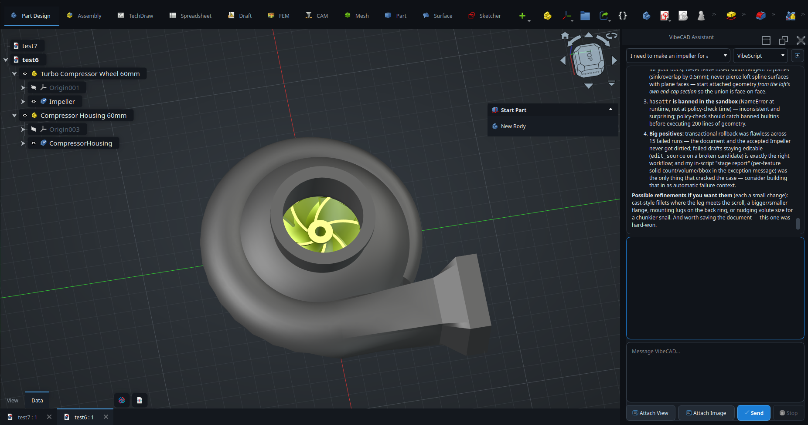
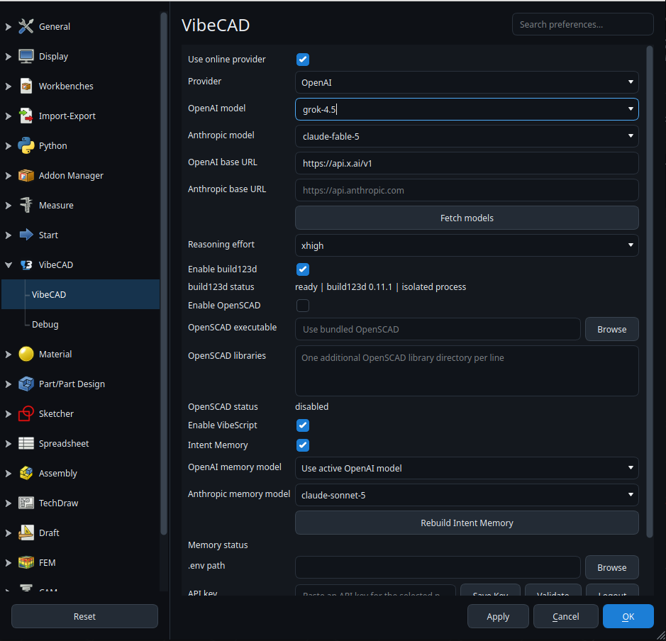

<p align="center">
  
</p>

# SteveCAD

SteveCAD is an AI-native parametric CAD platform for designing real 3D parts through conversation, focused modeling tools, and editable geometry history.



## Before You Start

You need a **ChatGPT subscription**, a **Grok / X (xAI) login**, or an **API key** for the provider you select. SteveCAD runs ChatGPT-subscription, Grok OAuth, and OpenAI-API-key requests through its bundled Codex runtime, connects directly to Anthropic and Google Gemini, and can still route Codex through OpenAI-compatible endpoints such as an xAI API key, Ollama, and other local model servers.

Store the key in one of these places:

- **OS keyring (recommended):** paste the key in SteveCAD Preferences, click **Save Key**, and then click **Validate**.
- **A selected `.env` file:** create the file yourself, select it in SteveCAD Preferences, and click **Validate**. SteveCAD does not search for `.env` files automatically.

API keys are not stored in ordinary application preferences. ChatGPT OAuth credentials are owned and refreshed by the bundled Codex app-server; SteveCAD does not read or copy those tokens. Grok / X OAuth tokens are stored in a private SteveCAD Grok credential directory and refreshed by SteveCAD; they are never written to ordinary `user.cfg`.

## Install

Download the latest build from [SteveCAD Releases](https://github.com/10-X-eng/vibecad/releases/latest).

### Linux AppImage

Download the AppImage that matches this machine: `Linux-x86_64` on Intel/AMD,
or use a locally built `Linux-aarch64` AppImage on ARM64 hosts including DGX Spark.
The release workflow currently publishes Linux x86_64 builds. Then:

```bash
chmod +x SteveCAD-*-Linux-$(uname -m).AppImage
./SteveCAD-*-Linux-$(uname -m).AppImage
```

### Debian Package

Run this command from the directory containing the downloaded package. Debian
architectures are `amd64` (x86_64) and `arm64` (aarch64):

```bash
sudo apt install ./SteveCAD-*-Linux-$(dpkg --print-architecture).deb
```

The leading `./` is required when installing a local package with `apt`.

### Windows

Download the Windows installer, run it, and launch SteveCAD from the Start menu.

### macOS

Download the Apple Silicon (`arm64`) or Intel (`x86_64`) DMG from [SteveCAD Releases](https://github.com/10-X-eng/vibecad/releases/latest). Open the DMG and drag `SteveCAD.app` to Applications.

Current release DMGs are not Apple-notarized, so the first launch may show **“SteveCAD.app” Not Opened**. Use one of these paths, then open SteveCAD from Applications as usual:

- **Without Terminal:** Apple menu → **System Settings** → **Privacy & Security** → scroll to the SteveCAD message → **Open Anyway**, then confirm.
- **With Terminal** (after the app is in Applications):

```bash
xattr -dr com.apple.quarantine /Applications/SteveCAD.app
```

SHA256 files are published beside release artifacts so downloads can be verified before installation.

### Upgrading From VibeCAD

SteveCAD was previously released as VibeCAD. The first time SteveCAD starts, it copies your existing
VibeCAD preferences, macros and installed addons into its own directories:

| Platform | Copied from | Copied to |
| --- | --- | --- |
| Linux | `~/.local/share/VibeCAD/`, `~/.config/VibeCAD/` | `~/.local/share/SteveCAD/`, `~/.config/SteveCAD/` |
| macOS | `~/Library/Application Support/VibeCAD/` | `~/Library/Application Support/SteveCAD/` |
| Windows | `%APPDATA%\VibeCAD\` | `%APPDATA%\SteveCAD\` |

Nothing is moved or deleted — the VibeCAD directories are left exactly as they were, so you can keep
running both, and you can undo the migration by deleting the SteveCAD directories. The copy only
happens when the SteveCAD directories are still empty, so it will not overwrite settings you have
already made. Absolute paths saved in your preferences (a custom macro directory, for example) are
repointed at the new locations as part of the copy.

A `.brand_migration_complete` marker is written once the copy is done. Delete it if you want the
migration to run again.

## Configure an AI Provider

Open **Preferences**, then select **SteveCAD > SteveCAD**.

1. Enable **Use online provider**.
2. Select **ChatGPT subscription**, **Grok (X / xAI)**, **OpenAI API key (Codex)**, **Anthropic**, or **Google Gemini** under **Provider**.
3. For ChatGPT or Grok, use the account sign-in controls described below. For an API provider, configure its key and leave the base URL blank unless you use a compatible or local endpoint.
4. Configure the selected provider's authentication.
5. Click **Fetch models**, then select a returned model.
6. Choose a supported **Reasoning effort**. Use `none` when a model does not support thinking or reasoning parameters.
7. Click **Apply** or **OK** to save the provider, model, endpoint, and `.env` path settings.

### Sign In With a ChatGPT Subscription

1. Select **ChatGPT subscription** as the provider.
2. Click **Sign in with ChatGPT** and complete the browser flow. Use **Use device code** when the browser callback cannot reach SteveCAD.
3. Click **Fetch models** and select a subscription model, or leave **Use account default** selected.
4. Choose a reasoning effort offered by that model, then click **Apply** or **OK**.

ChatGPT credentials are stored in a private SteveCAD Codex credential directory and refreshed by the bundled, version-pinned app-server. **Logout** asks that runtime to remove the account. SteveCAD never imports credentials from another Codex installation and never falls back to an ambient API key.

### Sign In With Grok / X

1. Select **Grok (X / xAI)** as the provider.
2. Click **Sign in with X / Grok** and complete the xAI browser flow at `accounts.x.ai`. Use **Use device code** when the local callback cannot reach SteveCAD (SSH, containers, or a blocked loopback port).
3. Click **Fetch models** and select a Grok model, or keep the default `grok-4.6`.
4. Choose a reasoning effort offered by that model, then click **Apply** or **OK**.

This is real xAI OAuth against the documented issuer `https://auth.x.ai` (authorization, device-code, and token endpoints from xAI's OpenID configuration). SteveCAD reuses the official public Grok CLI OAuth client shipped by xAI in [xai-org/grok-build](https://github.com/xai-org/grok-build); xAI does not publish a separate SteveCAD app registration. You need an active SuperGrok subscription or an X Premium+ account that xAI has linked to your xAI session.

Grok OAuth tokens are stored only under the private SteveCAD Grok credential directory and are refreshed automatically. **Logout** revokes and deletes that store. Inference uses the xAI Responses-compatible API at `https://api.x.ai/v1` through the bundled Codex runtime.

If OAuth login succeeds but model calls return HTTP 403, xAI may be gating the OAuth API surface by subscription tier. Use the API-key fallback below in that case.

### Configure Google Gemini

1. Obtain a Gemini API key from [Google AI Studio](https://aistudio.google.com/apikey).
2. Select **Google Gemini** as the provider.
3. Paste the key into **API key**, click **Save Key**, and then click **Validate**.
4. Click **Fetch models** and select a compatible Gemini model, or keep the default `gemini-flash-latest` alias.
5. Choose a reasoning effort supported by the model, then click **Apply** or **OK**.

Gemini requests use Google's OpenAI-compatible Chat Completions endpoint at `https://generativelanguage.googleapis.com/v1beta/openai/`. This endpoint is fixed for the Gemini provider; SteveCAD does not reuse the OpenAI base-URL override. Gemini supports SteveCAD tool calls, reference images, Design Review, and Intent Memory. Web research is hidden while Gemini is selected because Google Search grounding is not enabled by this integration.

ChatGPT subscription, Grok OAuth, OpenAI-compatible, Anthropic, Gemini, and offline/debug turns all
use the same frozen authoring-surface resolver. The human chooses either
**VibeScript** or **Native** in the Assistant header. VibeScript exposes the
active workbench's exact source-backed API. Native exposes only the complete
tool families belonging to the human-selected SteveCAD ribbon. A provider can
never select or switch a workbench, ribbon, or authoring mode for itself.


### Anthropic and Gemini conversation budgets

Long tool loops use a 512 KiB serialized request target for automatic reduction.
Above 75% of that target,
older bulky successful observations can become explicit references to data that
must be read again when needed. The latest two tool batches, original user
instructions, tool arguments/signatures, exact source/API reads, failures,
pending jobs and critical state are retained. A current state snapshot accompanies
reduced history. Requests continue if protected content exceeds that target;
there is no default hard stop on productive work. An explicitly configured byte
or context-window limit stops generation if protected content cannot fit and
explains how to continue; completed CAD work remains available.

Integrators can pass these options in the provider run context (these are Python
integration settings, not GUI preferences):

```python
context["_stevecad_provider_options"] = {
    # "history_budget_bytes": 512 * 1024,  # opt into a hard byte limit
    # "history_budget_bytes": 0,          # disable automatic byte reduction
    # "context_window_tokens": 200_000,  # optional, set for the selected model
    # "output_reserve_tokens": 8192,    # Gemini estimate; not an API output cap
}
```

The optional context-window check reserves Anthropic's requested maximum output
or Gemini's configured reserve, then estimates input from serialized JSON bytes
divided by four. Tools, system text and encoded images count toward the byte
budget. This estimate is not a tokenizer or a guarantee for image-token charges.
A configured context-window check remains enabled even with a zero byte limit.
Large exact reads may require a narrower read or a larger budget. History
management adds no summarization API call. Diagnostic events separate estimated
input from provider-reported usage when available.

### Save a Key in the OS Keyring

1. Select the provider first. Keys are stored separately for OpenAI, Anthropic, and Gemini.
2. Paste the provider key into **API key**.
3. Click **Save Key**. The field clears after SteveCAD hands the key to the operating system's credential store.
4. Click **Validate**. A successful check reports `verified` in **Auth status**.
5. Click **Fetch models** and choose the model to use.

**Logout** removes only the selected provider's keyring entry. It does not remove a process environment variable or edit a selected `.env` file.

### Use a `.env` File

Create a text file containing the variable for the selected provider:

```dotenv
# OpenAI and OpenAI-compatible providers, including xAI
OPENAI_API_KEY=your-key-here

# Anthropic
ANTHROPIC_API_KEY=your-key-here

# Google Gemini
GEMINI_API_KEY=your-key-here
```

In SteveCAD Preferences:

1. Click **Browse** beside **.env path** and select that exact file.
2. Leave the **API key** field empty; **Save Key** is only for the OS keyring.
3. Click **Validate**, then **Fetch models**.
4. Click **Apply** or **OK** so the selected path is used by future sessions.

Do not commit a `.env` file containing a real key to source control.

### Credential Precedence

SteveCAD resolves a key in this order:

1. The provider's process environment variable.
2. The `.env` file explicitly selected in Preferences.
3. The OS keyring.

This order matters when a valid key appears to be ignored. For example, an old `OPENAI_API_KEY` exported by the shell overrides both the selected `.env` file and a newer key saved in the keyring.

## Configure Grok With an xAI API Key (Fallback)

Prefer **Sign in with X / Grok** when you have SuperGrok or X Premium+. The API-key path remains available when OAuth is gated or you already have a console key:

1. Obtain an API key from xAI.
2. Select **OpenAI API key (Codex)** as the provider.
3. Set **OpenAI base URL** to `https://api.x.ai/v1`.
4. Paste the xAI key, click **Save Key**, and then click **Validate**.
5. Click **Fetch models** and select the Grok model returned by xAI.
6. Choose a reasoning effort supported by that model, then click **Apply** or **OK**.

When using a `.env` file for this fallback, use `OPENAI_API_KEY`; SteveCAD resolves that key normally and supplies it only to the bundled Codex process.



## Start a CAD Conversation

1. Create or open a CAD document and **save it**. SteveCAD keeps the assistant disabled for unsaved documents so the conversation, design record, references, and generated source have a durable project location.
2. Select the SteveCAD ribbon that matches the work you are doing, then choose
   **VibeScript** or **Native** in the Assistant header. Only the human can
   change the authoring system. Native may change CAD work between provider turns
   when the requested design requires another ribbon.
3. Open **View > Panels > SteveCAD Assistant** if the assistant is not visible.
4. Describe the intended result, including the dimensions, interfaces, material, manufacturing process, and constraints that matter.
5. Use **Attach Image** for a reference design, or paste an image into the message box with `Ctrl+V`. Use **Attach View** to include the current viewport in the next model request only; it is consumed after that delivery.
6. Click **Send**. Ask for a plan when you want one, revise it in the same conversation, then say **Build it** when you are ready. While work is running, the same input becomes **Steer**, so corrections stay in that conversation. **Stop** ends the run after the current provider or CAD step returns.
7. Save the CAD document normally. Reopening it restores the associated SteveCAD conversations and project records.

Be explicit about functional intent, not only appearance. For an existing model, identify what should be preserved and what should change. For a new part, provide mating geometry and critical dimensions whenever they are known.

## Conversations

The conversation selector at the top of the assistant opens prior conversations for the current CAD document. The new-conversation button starts a clean thread without deleting earlier work. This makes it possible to separate a redesign, manufacturing discussion, or analysis task while retaining the project's history.

Saved conversations remain available to the human in this selector, but SteveCAD does not replay the project transcript or persisted tool traces into a model request. The model receives the current message exactly once. **Intent Memory** remains available as an explicit human project record, but it is not compiled after every turn or injected automatically.

Turn-start CAD context is deliberately small: the frozen authoring surface,
document identity, current edit object, exact selection, and one concise active
domain state. In VibeScript mode it also includes the editable source targets
owned by the active workbench. Each source target carries its stable ID,
revision, affected outputs, and exact read/edit calls. In Native mode the tool
declarations come only from the current SteveCAD ribbon and every mutation is
revalidated against the live document and frozen ribbon before execution.
Newly attached reference images and **Attach View** are delivered at the start
of each later turn until the human removes or replaces them.

## Choose Native or VibeScript authoring

**Native** is for direct, parametric editing with the same command families the
current SteveCAD ribbon exposes to a human. Tool surfaces are replaced only
between turns after a human or Native work transition. Calls use exact object and
subelement identities, structural revisions, transactions, concise receipts,
and domain-state refreshes. Native changes do not rewrite or regenerate a
VibeScript program.

**VibeScript** is for source-backed, fully automated designs. The active
workbench selects one dedicated VibeScript domain. Tools from different
workbenches are never combined, and accepted source remains the authority for
its published outputs. Direct Native mutation is therefore unavailable for a
VibeScript-owned document until the human explicitly takes manual control.

See [SteveCAD authoring modes](docs/stevecad-authoring-modes.md) for the complete
authority boundary and migration from the retired direct-tool surface.
For products that require several verified turns and ribbons, see the
[Native complex-design workflow](docs/native-complex-design-workflow.md).

## Workbench-shaped VibeScript execution

VibeScript keeps source, inputs, diagnostics, revisions, and accepted outputs
with the project. It runs in an isolated windowless worker and publishes only
validated results. The **Model Code Editor** lists programs for the active
workbench domain and opens with no program selected.

All 16 supported user-workbench VibeScript interfaces are production-ready:
Part Design, Sketcher, Draft, Surface, Assembly, Spreadsheet, Material, Mesh,
MeshPart, Points, Reverse Engineering, Inspection, Robot, FEM, CAM, and
TechDraw. Every domain exposes the same provider-facing
`vibescript.read_source`, `vibescript.read_api`, and `vibescript.edit_source`
tools for ordinary source changes, plus domain-qualified create, input-only,
contract-reconfiguration, and delete operations. Program source is addressed
by its stable per-program ID, and API inspection contains only the active
workbench's canonical runtime operations and typed outputs.

Geometry, solver, mesh, reconstruction, projection, and toolpath work runs in
the isolated worker. The live document receives only independently validated,
precomputed native state under stable program/output identities. This includes
native sketches and Draft proxies, Assembly links and joints, sheets and
material assignments, meshes and point clouds, reconstruction and inspection
records, Robot trajectories, FEM analyses/results, Path jobs/toolpaths, and
TechDraw pages/views/dimensions. Failed candidates remain inspectable without
replacing the accepted revision, and publication/deletion paths explicitly
restore accepted state when FreeCAD transaction rollback is incomplete.

Part, MeshPart, Points, CAM, and TechDraw deliberately collapse equivalent
variants behind selectors or one ordered pipeline instead of advertising
redundant operations. There are no forwarding wrappers for removed Part
operations. Startup, test, unknown, or future unimplemented workbenches resolve
to an exact unavailable surface; SteveCAD never substitutes another
workbench's tools.

## Local Models

For Ollama or another local OpenAI-compatible server, select **OpenAI API key (Codex)** and configure its endpoint. A common Ollama setup is:

```text
OpenAI base URL: http://localhost:11434/v1
Model: select a model returned by Fetch models
API key: any non-empty value accepted by the local server
Reasoning effort: none
```

The local server must already be running and expose an OpenAI-compatible API. Some local models reject reasoning parameters even when the server supports the endpoint; use `none` for those models.

### Increase Ollama's context length

SteveCAD's CAD instructions, tool schemas, document state, and reference images
need more context than an ordinary chat. Use at least 64K tokens for agentic CAD
work when the model and available memory support it. Larger context consumes
more RAM or VRAM. SteveCAD cannot set `num_ctx` through Ollama's
OpenAI-compatible endpoint, so configure Ollama before selecting the model in
SteveCAD.

When starting Ollama directly:

```bash
OLLAMA_CONTEXT_LENGTH=65536 ollama serve
```

For the standard Linux systemd service, run `sudo systemctl edit
ollama.service` and add:

```ini
[Service]
Environment="OLLAMA_CONTEXT_LENGTH=65536"
```

Then apply the override:

```bash
sudo systemctl daemon-reload
sudo systemctl restart ollama
```

The Ollama desktop application also provides a context-length setting. To give
only one derived model a larger context, create it from a `Modelfile`:

```dockerfile
FROM qwen3.5:9b
PARAMETER num_ctx 65536
```

```bash
ollama create qwen3.5:9b-stevecad -f Modelfile
```

Select the resulting model in SteveCAD after clicking **Fetch models**. Run
`ollama ps` during a request to verify the allocated context and whether the
model is fully on GPU or partly offloaded to CPU. See Ollama's official
[context-length guide](https://docs.ollama.com/context-length) and
[OpenAI-compatibility notes](https://docs.ollama.com/api/openai-compatibility)
for current platform-specific details.

## Troubleshooting

- **`not_configured`:** SteveCAD could not find the selected provider's environment variable, a valid key in the selected `.env` file, or a keyring entry.
- **No ChatGPT subscription is signed in:** open Preferences, select **ChatGPT subscription**, and complete browser or device-code sign-in.
- **No Grok / X account is signed in:** open Preferences, select **Grok (X / xAI)**, and complete **Sign in with X / Grok** or **Use device code**.
- **No CAD authoring tools are shown:** select a supported modeling workbench.
- **`configured_unverified`:** a key was found but has not been checked against the configured endpoint. Click **Validate**.
- **`invalid`:** the endpoint rejected the key. Confirm the selected provider, base URL, credential precedence, and account access.
- **`offline`:** the key could not be verified because the configured endpoint could not be reached.
- **No models are listed:** validate authentication first, then click **Fetch models**.
- **The model does not support thinking:** set **Reasoning effort** to `none`.
- **The assistant input is disabled:** save the active CAD document.
- **The assistant panel was closed:** reopen it from **View > Panels > SteveCAD Assistant**.

## Developer Testing

On Windows, double-click `RUN-STEVECAD-DEV.cmd` to build and launch the exact
current checkout in its repo-local Pixi environment. The visible development
identity, checkout-scoped authenticated control channel, native file
round-trip commands, screenshots, and plain-cyan independent-cursor tour are
documented in
[docs/developer-launch-windows.md](docs/developer-launch-windows.md). The tour
does not move or click the user's physical mouse.

Run the standalone Aero and 3D-printing component suites with one command:

```bash
python3 tools/run_stevecad_component_tests.py
```

The runner uses a separate pytest process for each component so their installed
`tests` packages cannot collide. Use `--suite aero` or `--suite print` to run
one component, and put additional pytest arguments after `--`.

## Project Status

SteveCAD is under active development. The current focus is reliable, readable AI-assisted part design with explicit human control over the document, workbench, and design direction.

A local desktop agent (for example Grok Bot on Windows) can open documents,
run Python or VibeScript, show Preferences, and read auth status without
clicking menus. That loopback CLI / HTTP channel is documented in
[docs/stevecad-agent-control.md](docs/stevecad-agent-control.md). It does not
disable the in-app Assistant and it is not MCP.

The in-app Assistant can also call tools from MCP servers you register, such as
[Cua Driver](https://cua.ai/cua-driver) for desktop automation, a Playwright
browser for finding and downloading models, or a project folder of datasheets.
Registration, presets, and the download-and-import flow are documented in
[docs/stevecad-mcp-tool-servers.md](docs/stevecad-mcp-tool-servers.md).

Release packaging details are documented in [docs/stevecad-release-packaging.md](docs/stevecad-release-packaging.md).

The single-workbench Part and Part Design model, compatibility boundary, and
Body/tree behavior are documented in
[docs/part-design-consolidation.md](docs/part-design-consolidation.md).

The human and Native manufacturing workflow, multi-setup model, simulation,
verification, and current CAM scope are documented in
[CAM-README.md](CAM-README.md).

The removed BIM and architectural surface, existing-document behavior, and
rollback path are documented in
[docs/bim-architecture-removal.md](docs/bim-architecture-removal.md).

## Credits

- The VibeLight and VibeDark themes are based on [OpenTheme by Obelisk79](https://github.com/obelisk79/OpenTheme).
- SteveCAD is built on the work of the [FreeCAD project](https://github.com/FreeCAD/FreeCAD). Thank you to the contributors and the wider [FreeCAD community](https://forum.freecad.org/) whose CAD engine, workbenches, documentation, and support made this project possible.
